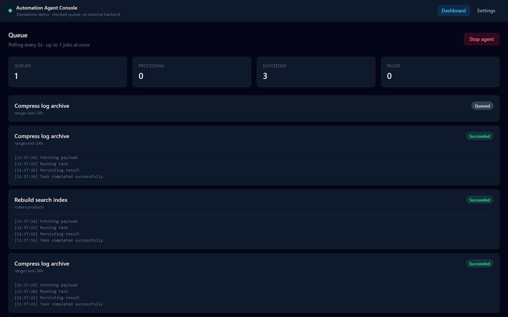
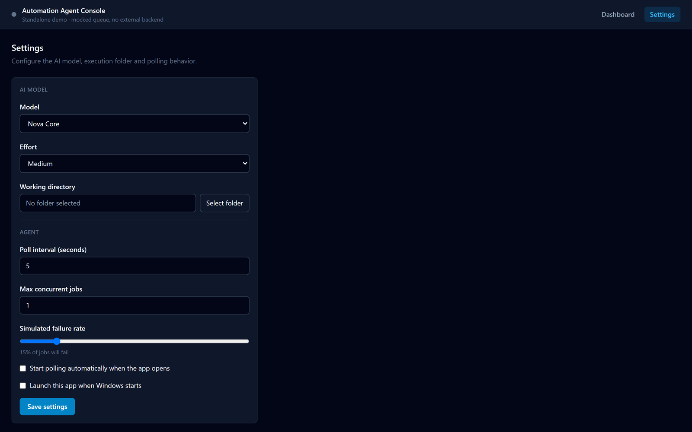

# Automation Agent Console (Demo)

[](https://tauri.app/)
[](https://www.rust-lang.org/)
[](https://react.dev/)
[](https://www.typescriptlang.org/)


A fully working **desktop application** (Tauri + React) that demonstrates the shape of
a background automation agent: it lives in the system tray, polls a **mocked job
queue** on an interval, processes jobs one at a time with a live log, and exposes a
Settings screen to control the AI model, effort level, working directory and polling
behavior. Everything (the queue, the jobs, the settings) is simulated in memory and
in a local config file. There is **no external backend, no real queue, no real AI
provider, and no network calls** of any kind.

This project is a portfolio piece: it is not connected to, and does not depend on, any
production system.

## Screens

The agent running: the queue is polled on an interval, one job is processed at a time, and
each job keeps its own step by step log.



Settings, persisted to a real JSON config file through the Rust backend.



## What it demonstrates

- **A real desktop shell**: minimizes to the system tray instead of quitting, reopens
  from a tray icon click or its "Open" menu item, and can be configured to launch
  automatically with the OS.
- **Polling a queue** for pending work, processing **one job at a time** by default
  (configurable), with a live step-by-step log per job.
- A **Settings** screen mirroring what a real automation agent needs to configure:
  AI model, effort/reasoning level, working directory (native folder picker), poll
  interval, concurrency, simulated failure rate, launch-at-startup, and auto-start.
- Settings persist to a real JSON config file on disk (via the Rust backend), the same
  pattern a production desktop agent would use, not just browser storage.

## Architecture

```
src/                       React frontend
  domain/                  entities and interfaces (QueueSource, SettingsStore)
  data/                    mock queue (in-memory) + settings store (Tauri commands, with a
                           localStorage fallback so the UI also runs in a plain browser)
  services/                AgentService, the orchestration/business logic, framework-agnostic
  hooks/                   useAgent, a thin React adapter over AgentService's subscribe/emit API
  components/, pages/      shared UI, Dashboard and Settings screens

src-tauri/                 Rust backend (the actual desktop shell)
  src/lib.rs               tray icon + menu, window show/hide/minimize-to-tray, command handlers
  src/settings.rs          AgentSettings model + JSON file persistence (with unit tests)
```

- **Dependency Inversion**: `AgentService` depends only on the `QueueSource` and
  `SettingsStore` interfaces from `domain/`. The mock queue could be replaced by a real
  polling client without touching `AgentService` or the UI.
- **Observer pattern**: `AgentService` keeps no React dependency at all, it exposes
  `subscribe(listener)` and notifies listeners on every state change. `useAgent` is the
  only place that turns that into React state, so the service itself is trivially
  testable outside of any UI framework (see `src/services/__tests__`).
- **Composition root**: `services/container.ts` wires the concrete mock repositories
  into the single `AgentService` instance used by the app.
- **Ports at the OS boundary too**: the frontend calls `invoke("load_settings")` /
  `invoke("save_settings")`; the Rust side owns the actual file I/O
  (`src-tauri/src/settings.rs`), keeping persistence logic out of the UI layer exactly
  like the repository pattern on the frontend.

## Stack

React 18 · TypeScript · Vite · React Router · Tailwind CSS · Vitest, **Tauri 2 / Rust**
for the desktop shell (system tray, native folder picker, autostart, JSON config file).

## Getting started

Requires Node.js and the Rust toolchain (`cargo`) with Tauri's platform prerequisites
(on Windows: the WebView2 runtime and MSVC Build Tools, see the
[Tauri prerequisites guide](https://tauri.app/start/prerequisites/)).

```bash
npm install
npm run tauri dev
```

This opens the actual desktop window. Click **Start agent** on the dashboard to begin
polling the mocked queue, jobs are processed one at a time by default. New jobs
occasionally appear on their own, simulating an external system enqueuing work. Closing
the window minimizes the app to the system tray; use the tray icon's **Quit** to exit
for real.

To run just the web UI in a browser (no tray, settings fall back to `localStorage`):

```bash
npm run dev
```

To produce an installable build (`.msi`/`.exe` on Windows):

```bash
npm run tauri build
```

## Testing

```bash
npm test                      # frontend: AgentService against fake timers + fake repos
cd src-tauri && cargo test    # backend: settings persistence round-trip tests
```

`AgentService` is tested with fake in-memory implementations of `QueueSource` and
`SettingsStore` and Vitest's fake timers, covering the full queue → processing →
success/failure lifecycle deterministically. The Rust `settings` module is tested for
defaulting, round-tripping, and recovering from a corrupted config file.

## Type-check & build

```bash
npm run build
```
